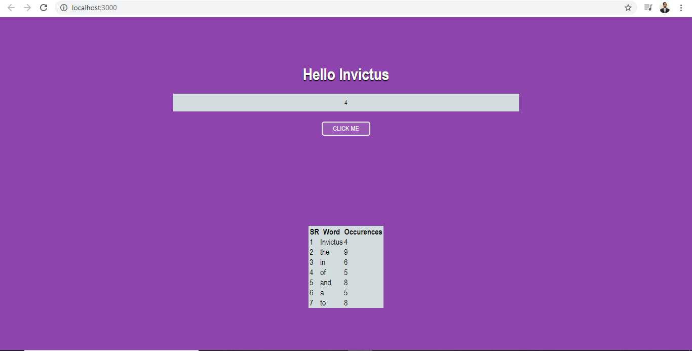
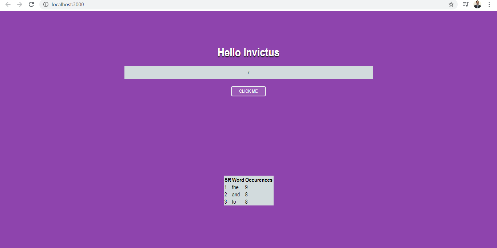

<h2 align="center">
   Reactjs App 
  <a href="https://devashish-7.github.io/resume/" target="_blank">DEVASHISH JANGID</a>
</h2>

  

  

 

 &nbsp;
 &nbsp;
 &nbsp;
 &nbsp;

## Built With

My personal portfolio <a href="https://devashish-7.github.io/resume/" target="_blank">DEVASHISH JANGID</a> which features some of my github projects as well as my resume and technical skills. 

This project was built using these technologies.

- React.js
- HTML
- CSS3
- VsCode

## Features

**📖 Display the top N words and their frequency of occurrence in the frontend, in a tabular format**

**🎨 Styled with React-Bootstrap and Css with easy to customize colors**

**📱 Fully Responsive**

## Getting Started

Clone down this repository. You will need `node.js` and `git` installed globally on your machine.

## 🛠 Installation and Setup Instructions

1. Installation: `npm install`

2. In the project directory, you can run: `npm start`

Runs the app in the development mode.\
Open [http://localhost:3000](http://localhost:3000) to view it in the browser.
The page will reload if you make edits.

## Usage Instructions

Open the project folder and Navigate to `/src/App.js`.  
You will find all the components used and you can edit your information accordingly.

Open the project folder and Navigate to `/src/App.js`.  
in line 42 you can change if condition to get different outputs.

- Case 1 :- occurances of word >= inputNumber (output :- you will get all words whose frequency of occurrence is equal or greater than input number)
- Case 2 :- occurances of word <= inputNumber (output :- you will get all words whose frequency of occurrence is equal or less than input number)
- Case 3 :- occurances of word == inputNumber (output :- you will get all words whose frequency of occurrence is equal to input number)
- Case 4 :- occurances of word > inputNumber (output :- you will get all words whose frequency of occurrence is greater than input number)
- Case 5 :- occurances of word < inputNumber (output :- you will get all words whose frequency of occurrence is less than input number)

### deploy

<a href="" target="_blank">REACTJS APP</a>
Give a ⭐ if you like this website!
